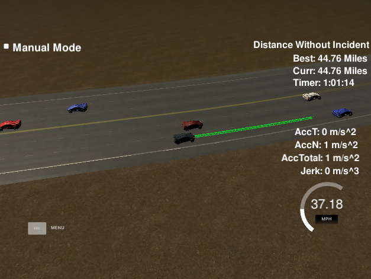

# Path Planning
Quintic Polinomial Path Planning for CarND-Path-Planning-Project

## Project description
<p align="center">
     
     <br>driving_scenarios
</p>

The goal of this project is to safely navigate a car around a virtual highway with other traffic that is driving +-10 MPH of the 50 MPH speed limit using a path planning algorithm. The autonomous car should drive passengers with comfort meaning with limited maximum acceleration and jerk.

A Path-Planner generates a set of trajectories with different target speed, duration, and target driving lanes. Then, a cost function is calculated for every trajectory and the trajectory with the smallest cost is passed to a vehicle controller for execution. The Path-Planner contains stack machine with two states Lane-Keeping and Lane-Changing used to control the process of trajectory generation.

### Coordinate System for Motion Planning ###
Motion Planning is implemented in the FRENET´ FRAME. All transformations from FRENET´ FRAME coordinates to Cartesian coordinates are supported by special class Waypoints, which loads waypoint coordinates as [x,y,s,dx,dy] values from special file, supplied to the project, and fits two bsplines x(s) and y(s) - the x and y coordinates as functions of longitudinal s-parameter.

Transformation from FRENET coordinates (s,d) to Cartesian coordinates is implemented in two steps: evaluation of splines Fx(s) and Fy(s) at the s-coordinate and adding shift on the d-value along normal to the splines:

                        [x  y]^t = [Fx(s)  Fy(s)]^t + d * [-Fy'(s)  Fx'(s)]^t        (1)

During the first run, the position of the vehicle in Frenet space is initialized by the simulator as a point (x, y) in Cartesian space, which is then transformed to a point (s, d) Frenet space in two steps. During the first step, the s-coordinate is computed using gradient descent optimization solver:

                          Jxy(s) = sqrt( (x – Fx(s))^2 + (y – Fy(s))^2 )
                          
After that, during the second step, the d-coordinate is computed using formula (1) and the point (x, y), supplied by simulator. This Inverse transformation is added because the simulator doesn't provide the vehicle with the accurate position in Frenet space.

### State Machine ###
The state machine is implemented as object-oriented class PathPlanner, which supports two states: Lane Keeping and Lane Changing. The transaction between two states is implemented using a unique pointer, which contains the current active state. The switching between two states is initiated by one of these two states Lane Keeping or Lane Changing. 
####  Lane Keeping State ####
The Lane Keeping state is the default state of the car, implemented as a class LaneKeeping, and is used to generate velocity keeping trajectories that allow the car to keep the lane close to the speed limit with keeping a safe distance to the leading cars. In addition, this state generates candidate trajectories that allows the car to change the lane. When the car follows to a slowly leading vehicle, the cost of this trajectory is increased due to Jv increasing. As soon as a trajectory with a different target lane has a lower total cost, the lane keeping state is constructed and returned to PathPlanner. The PathPlanner uses this state for optimal trajectory generation during next iteration. During evaluation of all candidate trajectories, the predicted trajectories of closest leading cars at the same lane are used for estimation and keeping safety distance cost Js to the nearest leading car.
#### Lane Changing State ####
The Lane Changing state is implemented as a class LaneChanging, and is responsible for executing a safe lane change maneuver. When this state is started to execute, the car has already started to move into the direction of target lane. The lane changing state starts to generate target trajectories with variation of target velocity and duration T along s-direction. For the lateral d-direction, a quintic polynomial trajectory is generated with the target d-coordinate in the center of the target lane and with a fixed lane change duration. During evaluation of all candidate trajectories, the predicted trajectories of all nearby cars at the same lane are used for estimation and keeping a safety distance cost Js to surrounding cars.
When the lateral d-distance is close to the target d-value, which is the center of lane in Frenet coordinates, the changing lane state is deactivated. As a result, the Lane Keeping will be used during next iteration.

### Results ###
The implemented path planner is able to navigate safely through highway traffic with speed close to target speed limit. The car is able to keep lane with speed limit if the current lane is empty or execute safety maneuvers in order to overpass slow cars. Below, you can see one example of car behavior:

<p align="center">
     
     <br>one_sample
</p>

### Basic Build Instructions

1. Clone this repo.
2. Make a build directory: `mkdir build && cd build`
3. Compile: `cmake .. && make`
4. Run it: `./path_planning`.

### Dependencies

* cmake >= 3.5
 * All OSes: [click here for installation instructions](https://cmake.org/install/)
* make >= 4.1
  * Linux: make is installed by default on most Linux distros
  * Mac: [install Xcode command line tools to get make](https://developer.apple.com/xcode/features/)
  * Windows: [Click here for installation instructions](http://gnuwin32.sourceforge.net/packages/make.htm)
* gcc/g++ >= 5.4
  * Linux: gcc / g++ is installed by default on most Linux distros
  * Mac: same deal as make - [install Xcode command line tools]((https://developer.apple.com/xcode/features/)
  * Windows: recommend using [MinGW](http://www.mingw.org/)
* eigen >= 3.3.7
  * http://eigen.tuxfamily.org/index.php?title=Main_Page
* [uWebSockets](https://github.com/uWebSockets/uWebSockets)
  * Run either `install-mac.sh` or `install-ubuntu.sh`.
  * If you install from source, checkout to commit `e94b6e1`, i.e.
```sh
    git clone https://github.com/uWebSockets/uWebSockets 
    cd uWebSockets
    git checkout e94b6e1
```

### Compile and Run Source code
```sh
cd quintic_planning
./run.sh
```

<!-- CONTRIBUTING -->
## Contributing
1. Commit your Changes (`git commit -m "Add some AmazingFeature"`)
2. Push to the Branch (`git push origin your_feature_branch`)
3. Create a merge request.


<!-- CONTACT -->
## Contact
Liuzhu Tong - tongliuzhu@126.com
